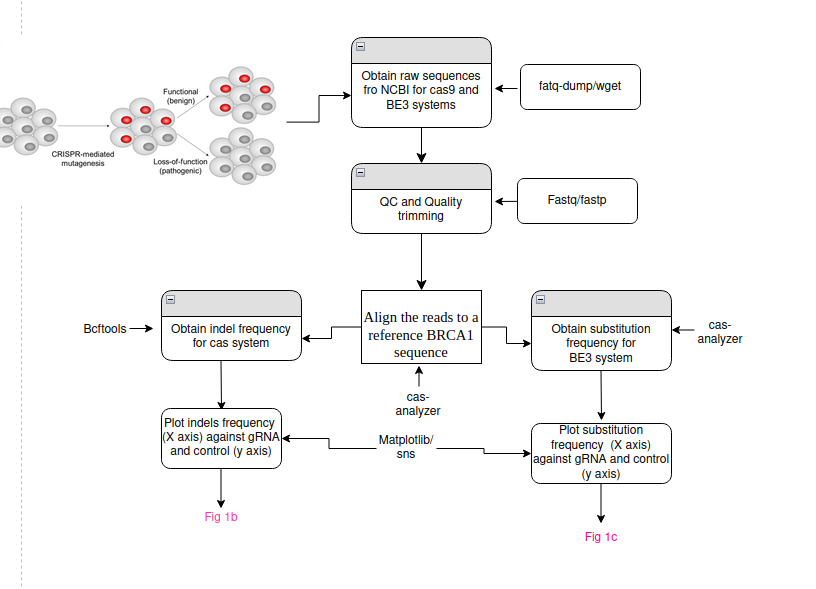
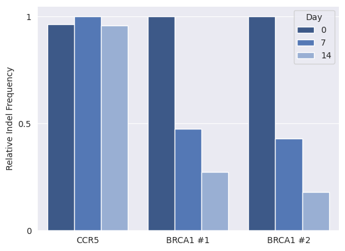
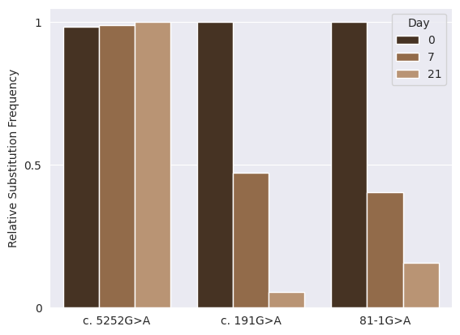

# Project 4D: A CRISPR-Based Base-Editing Screen for the Functional Assessment of BRCA1 Variants
# Submission
- [One-slide presentation file containing a flowchart of the pipeline](https://docs.google.com/presentation/d/e/2PACX-1vT87M_F-rHUIvvVH_KztEhMzVuLP4jFVxR5KxCQzLKBJn0eZXq7-HX2WX7GDgqtoYrDgx9by9zmjIq_/pub?start=false&loop=false&delayms=3000)
- [One-page scientific brief describing the project](https://docs.google.com/document/d/1hzCD6trX9lVIdvXPxJUcxIZwCAFg22XUBDdcr0NQm_E/edit?usp=drive_link)
- [1-2 minutes video presentation describing the importance of the paper](https://drive.google.com/file/d/17PZ6NVAjMKhkYkpRb_7D5kdPpSW0J7ij/view?usp=drive_link)
- [Code](https://colab.research.google.com/drive/1MSX3GpTS4z-YqX-t9UTU4Z5HOTWuTy4-?ouid=105991648897468162924&usp=drive_link)
- [Data](https://docs.google.com/spreadsheets/d/e/2PACX-1vTWWyFhXK03nG8pUbG8dcsXH5SiPXikXd-9bN5NcYcyYbPkPkmBNIGypZppIgViVysHBDRsW7JXlt7B/pubhtml)

## Figures
Pipeline Flowchart

Figure 1b

Figure 1c

